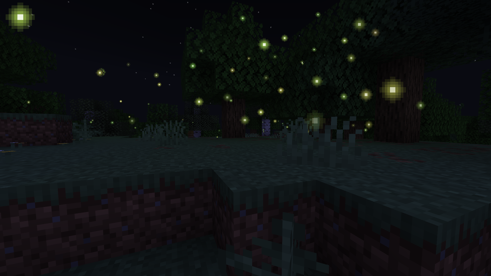
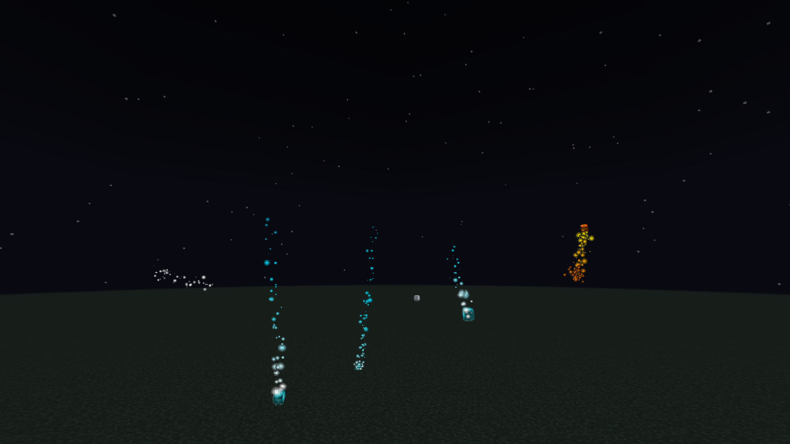

# Illuminations Reimagined

**An unofficial modern continuation of [Illuminations](https://github.com/Ladysnake/Illuminations) by Ladysnake,
updated for modern Minecraft on Fabric and NeoForge, with bug fixes, rewritten systems and all-new artwork.**

> ⚠️ This project is **not** affiliated with, maintained by, or endorsed by Ladysnake or the original
> Illuminations developers. Please report issues here, not to them.

Illuminations Reimagined is a **client-side** mod that adds ambient lights to make dark places feel alive.
It works on any server, including vanilla servers, and nothing needs to be installed server-side.





## Effects

| Effect | Where / when |
|---|---|
| **Fireflies** | At night, within a few blocks of the ground in forests, swamps, rivers, jungles, taigas, plains and savannas. Colour depends on the biome; drawn to nearby light. |
| **Glowworms** | Clinging to cave ceilings under forests, swamps, rivers and other green biomes. They drop if their ceiling is broken. |
| **Plankton** | Tiny glowing specks in dark ocean water. |
| **Chorus petals** | Drifting from chorus flowers; a burst of petals when a flower breaks. |
| **Prismarine crystals** | Floating in the water around sea lanterns. |
| **Will o' wisps** | Small glowing spirits that rise from soul sand in Soul Sand Valleys and slip out of soul lanterns, darting about and leaving trails of sparks that fade from white to cyan. |
| **Pumpkin spirits and poltergeists** | Halloween spirits (October by default, at night): pumpkin spirits burst out of jack o'lanterns trailing fiery sparks; poltergeists rise from skeleton skulls and from undead that die at night. |
| **Eyes in the dark** | In October (configurable), watching from pitch-black spots. They vanish if you get close or bring light. |

## Supported versions

| Minecraft | Fabric Loader | Fabric API | NeoForge |
|---|---|---|---|
| 26.3 | ≥ 0.19.5 | 0.161.0+26.3 | 26.3.0.43-beta |
| 26.2 | ≥ 0.19.5 | 0.161.0+26.2 | 26.2.0.88 |

Java 25 is required, as for Minecraft 26.x itself.

## Configuration

The config file is `config/illuminations_reimagined.json`. It is created on first launch and is safe to
hand-edit; invalid values are corrected on load. Options include:

* A master switch and global **density** (0–1000 %).
* A **maximum live count** for every effect, so particle numbers can never run away.
* Fireflies: spawn always (day too), spawn underground, core brightness, rainbow, light attraction, and orange autumn colours in October (off by default; not in the original).
* Per-biome-group firefly, glowworm and plankton rates (`DISABLED` / `LOW` / `MEDIUM` / `HIGH`) and firefly colour.
* A switch per dimension, to turn every effect off in a dimension (vanilla or modded) where you do not want them.
* Eyes in the dark: `SEASONAL` (October), `ALWAYS` or `DISABLED`, and a spawn rate.

Biomes are classified with vanilla and `c:` convention biome tags, so modded biomes that tag themselves
correctly are supported automatically.

## What changed from the original

**Removed:** every donor cosmetic (Twilight and Ghostly auras, the Frost, Solar, Bloodfiend, Dreadlich, Mooncult,
Chorus and Prismarine crowns, horns, halos, tiaras, wreaths, pride-heart and other pets, Jacko, and so on), the
cosmetics dashboard and its UUID-based network lookups, the self-updater and its bundled uninstaller, the
donation, update and greeting screens, and the override of Minecraft's own particle shader.

**Kept the same:** every effect behaves like the original: where and how often it spawns, its size, colours,
blinking, movement and lifetime, and the default settings for each biome.

**Fixed** (details in [`CHANGELOG.md`](CHANGELOG.md)):

* Fireflies no longer **live forever**, **teleport** onto light sources or **dive** toward y = 0. Light attraction
  only follows lit blocks the firefly can actually see.
* Spirits, fireflies and plankton no longer **freeze in place** after touching the ground, and poltergeists from
  undead deaths now actually appear.
* Spawning **never touches unloaded chunks**, caches biome lookups and caps every effect.
* Particles are **not registered** in the particle-type registry, which avoids registry-sync trouble on servers.
* Counts stay correct through world changes, disconnects and resource reloads.
* Glowworms and plankton no longer allocate a new `Random` every tick. Glowworms respect the modern world height
  and spawn in modern noise caves; plankton no longer floats out of the water into the sky.
* Biome detection no longer depends on the removed `Biome.Category`, which crashed with modded biomes.
* Eyes no longer run game logic inside rendering code.
* Chorus petals use one robust hook instead of a fragile chain of mixins.
* Will o' wisps render through the normal particle pipeline instead of a private immediate-mode buffer.

## Building

```bash
./gradlew build            # Minecraft 26.3 (default)
./gradlew build -Pmc=26.2  # Minecraft 26.2
```

Jars are written to `fabric/build/libs/` and `neoforge/build/libs/`. Version-specific dependency versions live
in `versions/<mc>.properties`.

## Licensing

* **Code:** GPL-3.0-or-later. This is a modified version of Illuminations, © 2021 Ladysnake, GPL-3.0-or-later;
  modifications © 2026 Romoslayer. See [`LICENSE`](LICENSE) and [`NOTICE.md`](NOTICE.md).
* **Textures and artwork:** GPL-3.0-or-later, like the code. None of the original Illuminations textures or other
  artwork (All Rights Reserved, Ladysnake) are used in this project. See [`LICENSE-ASSETS.md`](LICENSE-ASSETS.md).
* **Source:** the complete corresponding source code is available in this repository.

## Credits

* **doctor4t and the Ladysnake contributors** created the original
  [Illuminations](https://github.com/Ladysnake/Illuminations) and its ideas: fireflies, glowworms, plankton, chorus
  petals, eyes in the dark and will o' wisps.
* Build layout based on [MultiLoader-Template](https://github.com/jaredlll08/MultiLoader-Template) (CC0).
